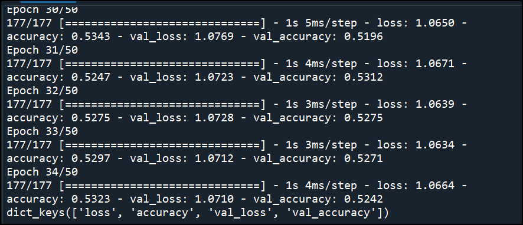
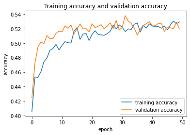
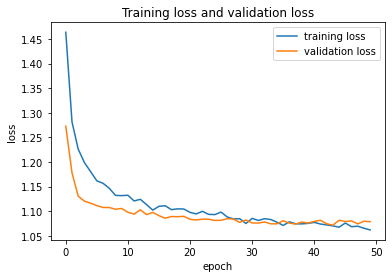

 # New_customer_prediction
 This model predict customer segment (A, B, C, D) based on customer's attribute

# Description
This is a project to analyse customer data and buying pattern to determine which segment (A, B, C, D) the customer belongs to based on customer's gender, age, profession, spending pattern, marital status, work experience, tertiary education, and family size. 

The dataset has been train using Functional API Neural Network model with 3 hidden layers and 128 nodes, batch normalization, dropout method and Early Stopping to prevent overfitting of data.

# How to use it
Clone the repo and run it.

train_new_customer.py is a script to train the data

Deploy_new_customer.py is a script for deployment.

# Outcome

The accuracy of the model is between 49% - 52% using 3 hidden layers and 128 nodes.

The model accuracy  cannot be improve further even after adding 6 hidden layer and also reduced or added nodes from 16 to 1024 nodes.

Suggestion 1: 
- to perform feature selection to reduce number of input into the training model

Suggestion 2: 
- to use Machine Learning pipeline to perform feature selection

Summary report:

              precision    recall  f1-score   support

           0       0.42      0.41      0.42       577
           1       0.42      0.35      0.38       549
           2       0.59      0.59      0.59       618
           3       0.61      0.70      0.65       677

    accuracy                           0.52      2421
   macro avg       0.51      0.51      0.51      2421
weighted avg       0.52      0.52      0.52      2421

# Credit
Credit goes to abisheksudarshan from Kaggle for the dataset
https://www.kaggle.com/datasets/abisheksudarshan/customer-segmentation

# Images

Training model architecture

Training Epoch: loss and accuracy

Training process plotted using Tensorboard

Summary report and accuracy score

Training & validation accuracy plot

Training & validation loss plot

