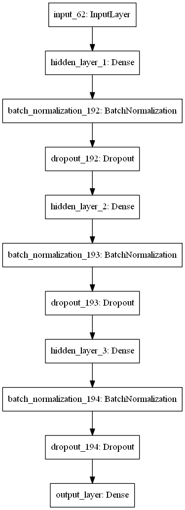
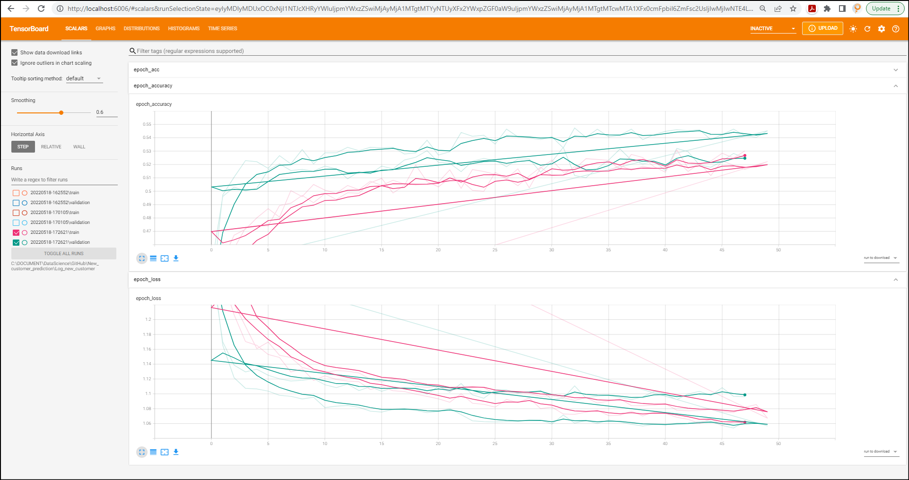
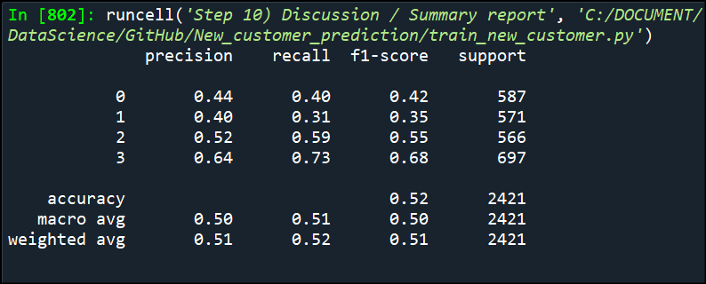

 # New_customer_prediction
 This model predict customer segment (A, B, C, D) based on customer's attribute

# Description
This is a project to analyse customer data and buying pattern to determine which segment (A, B, C, D) the customer belongs to based on customer's gender, age, profession, spending pattern, marital status, work experience, tertiary education, and family size. 

# How to use it
Clone the repo and run it.

train_new_customer.py is a script to train the data

Deploy_new_customer.py is a script for deployment.

# Outcome

# Credit
Credit goes to abisheksudarshan from Kaggle for the dataset
https://www.kaggle.com/datasets/abisheksudarshan/customer-segmentation

# Images

Training model architecture

Training process plotted using Tensorboard

Summary report and accuracy score

